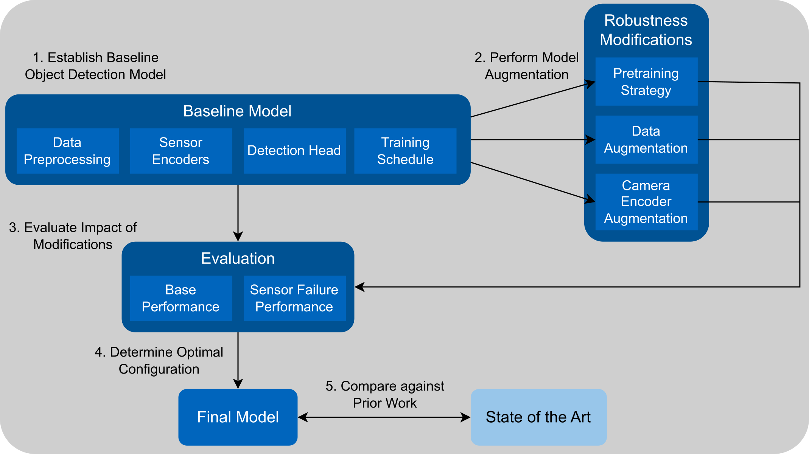

# Methods for Sensor Failure Mitigation in 3D Object Detection

### Master's Thesis at Technical University of Munich (TUM)
This Master's thesis was completed at TUM's [Chair of Automotive Technology](https://www.mos.ed.tum.de/en/ftm/home/) as part of the [Master of Science: Informatics](https://www.tum.de/en/studies/degree-programs/detail/informatics-master-of-science-msc) degree.\
The topic was supervised by [Prof. Dr.-Ing. Markus Lienkamp](https://www.mos.ed.tum.de/en/ftm/members/staff/prof-dr-ing-markus-lienkamp-personal-data/).\
Special thanks goes to my advisor [M. Sc. Felix Fent](https://www.mos.ed.tum.de/en/ftm/members/staff/felix-fent-msc/), Ph. D candidate at the Chair of Automotive Technology.

- 📄 [Read the Thesis](paper.pdf)
- 📊 [View the Presentation Slides](slides.pdf)

---

## Abstract
Accurate detection and modeling of the environment are crucial for developing autonomous driving systems.
State-of-the-art methods use sensor fusion, combining camera and LiDAR data, to surpass the performance of single-sensor methods.
However, these methods experience a significant performance drop in the event of a single sensor failure.

This Master’s Thesis proposes, implements, and evaluates a set of methods to mitigate this deficiency in existing sensor fusion models.

Key findings include:
- The proposed methods are **very effective** at **mitigating** the effects of **single sensor failure**.
- They also significantly improve performance in scenarios of **partial sensor failure**, such as partial occlusions.
- The **negative impact** on baseline performance (all sensors operating correctly) is **negligible**.
- Methods are **model-agnostic**, allowing for easy integration into other sensor fusion frameworks.

In summary, presented methods enable a sensor fusion system to retain performance close to that of a single-sensor model in the event of failure of the respective added sensor.


---

## Implementation Details

This is a modified version of the [BEVFusion](https://github.com/mit-han-lab/bevfusion) framework.

Key changes are:

- All models run using the CenterHead model. Only the object detection task is supported. The performance is worse than the TransFusionHead but training is stable.
    
    - The TransFusionHead is unstable during training if hyperparameters are not correctly tuned (and will crash in that case) making it hard to use for experimentation

- All used configurations for experiments may be found under ```configs/nuscenes/det/centerhead/lssfpn/```
- It is recommended to always load config files from the config folder instead of from the copied version next to the checkpoint

An overview of the Methodology applied:



### Usage

#### Fusion Training
```
torchpack dist-run -np 2 python tools/train.py configs/nuscenes/det/transfusion/secfpn/camera+lidar/swint_v0p075/convfuser.yaml --model.encoders.camera.backbone.init_cfg.checkpoint pretrained/swint-nuimages-pretrained.pth --load_from pretrained/lidar-only-det.pth 
```

#### Camera Training
```
torchpack dist-run -np 2 python tools/train.py configs/nuscenes/det/centerhead/lssfpn/camera/256x704/swint/default.yaml --model.encoders.camera.backbone.init_cfg.checkpoint pretrained/swint-nuimages-pretrained.pth
```

#### LiDAR Training
```
torchpack dist-run -np 2 python tools/train.py configs/nuscenes/det/transfusion/secfpn/lidar/voxelnet_0p075.yaml
```

#### Validation
```
torchpack dist-run -np 2 python tools/test.py configs/../default.yaml checkpoints/../latest.pth --eval bbox
```

#### Visualize
```
torchpack dist-run -np 2 python tools/visualize.py configs/../default.yaml checkpoints/../latest.pth --mode gt
torchpack dist-run -np 2 python tools/visualize.py configs/../default.yaml checkpoints/../latest.pth --mode pred
```


### Setting up the Environment
#### 1. Create Docker Image
```
$ cd docker && docker build . -t bevfusion-robust
```

#### 2. Create Docker Container
```
$ nvidia-docker run -it -v `pwd`/../data:/dataset --shm-size 16g bevfusion-robust /bin/bash

$ docker attach <name>

Options:
--shm-size 16g (shared memory size)
-v `pwd`/../data:/dataset (bind host folder to docker)
------------
-p 16006:6006 (bind port for tensorboard)
```

**if nvidia-docker is not installed:**

```
Replace:
$ nvidia-docker run ...

With:
$ docker run --runtime=nvidia --gpus all ...
```
#### 3. Ensure versions are correct
There is an issue with the mmcv install so run this:
```
$ pip uninstall mmcv
$ pip uninstall mmcv-full

$ MMCV_WITH_OPS=1 FORCE_CUDA=1 pip install mmcv==1.4.0 -f https://download.openmmlab.com/mmcv/dist/cu113/torch1.10.0/index.html
$ MMCV_WITH_OPS=1 FORCE_CUDA=1 pip install mmcv-full==1.4.0 -f https://download.openmmlab.com/mmcv/dist/cu113/torch1.10.0/index.html
```
If one of these commands fails, just ignore it (mmcv-full was renamed to mmcv at some point so there is something funky going on with the versions)
Afterwards run the following to ensure all versions are correct:
```
$ pip install setuptools==59.5.0
$ pip install numpy==1.23.5
$ pip install yapf==0.40.1
```
#### 4. Install the repository in the docker
```
$ cd home && git clone https://gitlab.lrz.de/perception/bevfusion.git
$ cd bevfusion && git checkout robustness
$ ln -s /dataset data
$ python setup.py develop
```
**Folder structure should look like this:**
```
bevfusion
├── ...
├── tools
├── data
│   ├── nuscenes
│   │   ├── maps
│   │   ├── samples
│   │   ├── sweeps
│   │   ├── v1.0-test
|   |   ├── v1.0-trainval
```

#### 5. Run Dataset Preprocessing (Once)
```
$ python tools/create_data.py nuscenes --root-path ./data/nuscenes --out-dir ./data/nuscenes --extra-tag nuscenes
```
Note: This command seems to imply that you can have the preprocessed files in a different folder from the dataset. You **cannot**. There are sections in the code that assume they are in the same folder.
